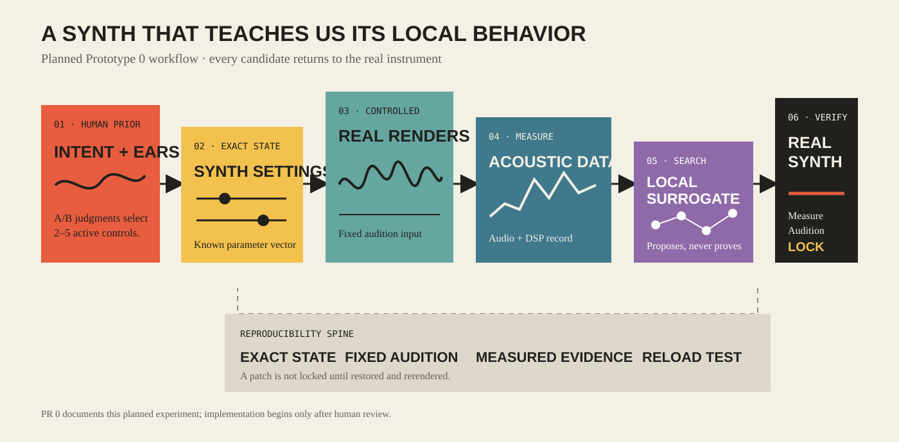

# Agentic Synth Twin

A local macOS research prototype for learning a validated, reproducible digital twin of a traditional synthesizer.

> **Status:** PR 0 defines architecture and governance only. Synth control, audio rendering, the web UI, DSP analysis, datasets, ML, optimization, and LOCK are not implemented yet.

## Core idea

A synthesizer can generate supervised training data because every rendered sound has a known parameter state. The project will test whether a deliberately small, human-constrained parameter region can support this loop:



Human listening first constrains the experiment. Controlled renders then connect exact synth parameters to measurable acoustic behavior. A local surrogate may cheaply search that sampled region, but every promising result must return to the real synth for measurement, audition, and exact-state locking.

## Why `clap-saw-demo`

[`clap-saw-demo`](https://github.com/abique/clap-saw-demo) is intentionally small, CLAP-native, and pedagogical. That makes it a suitable first instrument for exposing parameter/state behavior without hiding the experiment behind a production synthesizer's complexity. The exact upstream commit will be recorded in PR 1; this repository does not yet clone, build, or modify it.

## Research hypothesis

The project tests a bounded claim: within a small, deliberately sampled parameter region, a traditional synthesizer can supply its own labeled examples for learning **synth parameters → acoustic behavior**. A simple surrogate can then approximate the inverse search for promising settings, while real-synth verification remains authoritative.

This does **not** imply that the model understands the entire synthesizer or that predicted audio replaces the instrument.

## Human calibration

Before dataset generation, a local web interface will present controlled A/B movements for candidate parameters. Human YES/NO judgments will identify roughly 2–5 perceptually relevant active parameters; the rest remain frozen. This human prior is the primary defense against wasteful combinatorial search.

## Synthetic data and surrogate

For each future example, the system will save the exact synth state, deterministic audition render, experiment metadata, and a small set of DSP descriptors. A deliberately simple model will learn only the locally sampled relationship and report held-out error honestly.

## LOCK means reproducibility

`LOCK` will be a verified state transition, not a favorite button. It must preserve the exact plugin state, canonical parameter JSON, audio render, DSP measurements, and experiment metadata; after a synth reload, the state must be restored and rendered again for comparison.

## Planned architecture

The backend remains callable independently of the future Streamlit interface. Synth control, experiment logic, analysis, learning, and presentation have separate ownership boundaries. See [the architecture document](docs/architecture.md) for the complete conceptual chain, boundaries, and scope exclusions.

## Incremental roadmap

| PR | Milestone | Evidence required |
|---:|---|---|
| 0 | Repository architecture | Reviewed structure, docs, governance, and diagram |
| 1 | CLAP feasibility | Pinned `clap-saw-demo` build; load, enumerate, change, and restore one parameter |
| 2 | Canonical synth state | Machine-readable inventory discovered from the plugin |
| 3 | Deterministic rendering | Fixed input, timing, sample rate, and reproducible render path |
| 4 | Human A/B probe | Local one-parameter-at-a-time YES/NO workflow |
| 5 | DSP features | Small, documented acoustic descriptor set |
| 6 | Synthetic dataset | Traceable parameter/audio/feature examples |
| 7 | Surrogate model | Reproducible training and honest held-out metrics |
| 8 | Inverse optimization | “Darker, similar loudness, no clipping” candidates verified on the real synth |
| 9 | LOCK workflow | Save, reload, rerender, and compare exact patch state |

Each milestone is a separate human-reviewed PR. Agents never merge PRs.

## Validate PR 0 locally

PR 0 has no runtime application. From the repository root:

```bash
PYTHONPATH=src python3 -m unittest discover -s tests -v
python3 -m compileall -q src tests
git diff --check main...HEAD
```

## Deliberately out of scope

- LLM APIs and large agent frameworks
- MIDI 2.0
- ML-CLAP or semantic audio embeddings
- diffusion or generated-audio models
- multiple synthesizers, including Surge XT
- autonomous agent loops
- cloud services or a cloud backend
- production-quality UI

## Repository map

- `src/agentic_synth_twin/` — future reusable backend; currently package metadata only
- `tests/` — repository/scaffold checks in PR 0; behavioral tests in later PRs
- `docs/architecture.md` — conceptual components, boundaries, and decisions
- `docs/assets/` — editable documentation visuals
- `.github/` — review templates and proportionate CI
- `AGENTS.md` — operational contract for coding agents
- `llms.txt` — concise navigation for agents and web readers

## Contributing and security

Read [CONTRIBUTING.md](CONTRIBUTING.md) before proposing changes. Report security concerns using [SECURITY.md](SECURITY.md). Participation is governed by [CODE_OF_CONDUCT.md](CODE_OF_CONDUCT.md).

## License

[MIT](LICENSE)
