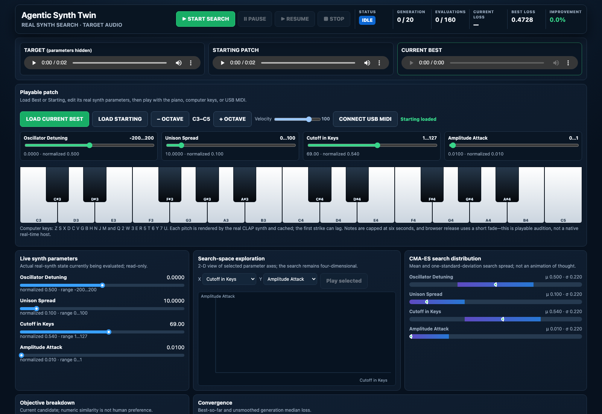

# Agentic Synth Twin

A local macOS research prototype for learning a validated, reproducible digital twin of a traditional synthesizer.

> **Status:** Milestone 9 additively extends the playable cockpit with a synth-adapter boundary, Surge XT 1.3.4 factory-preset retrieval, and bounded one-note local refinement. Target, Base, and Best remain playable through the same on-screen keyboard, computer keys, and browser-supported USB MIDI path. Notes are exact cached CLAP renders, not a low-latency native host; multi-note validation and LOCK remain unimplemented.




## Core idea

A synthesizer can generate supervised training data because every rendered sound has a known parameter state. The project will test whether a deliberately small, human-constrained parameter region can support this loop:


Human listening first constrains the experiment. Controlled renders then connect exact synth parameters to measurable acoustic behavior. A local surrogate may cheaply search that sampled region, but every promising result must return to the real synth for measurement, audition, and exact-state locking.

## Synth backends

[`clap-saw-demo`](https://github.com/abique/clap-saw-demo) remains the intentionally small research instrument pinned at upstream commit `f33b31fff459d66ac18207ec152b323aaa9306f9`. Milestone 9 adds Surge XT 1.3.4 as the first rich synth adapter: a bounded factory library supplies musical starting states before local real-synth refinement. Search, objective, cockpit, keyboard, cache, and evidence logic remain synth-independent.

## Research hypothesis

The project tests a bounded claim: within a small, deliberately sampled parameter region, a traditional synthesizer can supply its own labeled examples for learning **synth parameters → acoustic behavior**. A simple surrogate can then approximate the inverse search for promising settings, while real-synth verification remains authoritative.

This does **not** imply that the model understands the entire synthesizer or that predicted audio replaces the instrument.

## Human calibration

Before dataset generation, the local calibration app presents randomized, blinded A/B movements for candidate parameters. The listener plays both sounds, clicks YES or NO, and advances without conversational round trips; judgments are written directly to a local SQLite database. This human prior should constrain later sampling, but a level-driven answer is not yet evidence of an independent timbral effect.

## DSP measurements

The completed calibration pairs are reproduced on the real synth and measured without loudness normalization. RMS, peak, spectral centroid, 85% rolloff, and simple attack/release timing remain traceable to exact WAV hashes. The [Milestone 5 contract and results](docs/dsp-features.md) document the formulas and the key limitation: descriptor magnitude did not reliably predict the listener's YES/NO answer.

## Synthetic dataset and research forks

The first [synthetic dataset](docs/synthetic-dataset.md) contains one exact baseline plus 255 seeded, space-filling states across three human-authorized parameters. Milestone 7 separately tested a bounded global surrogate. [Milestone 8A](docs/direct-real-synth-search.md) is an intentional research fork: it bypasses that surrogate, scores richer audio representations, and asks the real synth directly on every candidate.

## LOCK means reproducibility

`LOCK` will be a verified state transition, not a favorite button. It must preserve the exact plugin state, canonical parameter JSON, audio render, DSP measurements, and experiment metadata; after a synth reload, the state must be restored and rendered again for comparison.

## Planned architecture

The backend remains callable independently of the future Streamlit interface. Synth control, experiment logic, analysis, learning, and presentation have separate ownership boundaries. See [the architecture document](docs/architecture.md) for the complete conceptual chain, boundaries, and scope exclusions.

## Incremental roadmap

| Milestone | Capability | Evidence required |
|---:|---|---|
| 0 | Repository architecture | Reviewed structure, docs, governance, and diagram |
| 1 | CLAP feasibility | Pinned `clap-saw-demo` build; load, enumerate, change, and restore one parameter |
| 2 | Canonical synth state | Machine-readable inventory discovered from the plugin |
| 3 | Deterministic rendering | Fixed input, timing, sample rate, byte-identical render proof, and one-button browser playback |
| 4 | Human A/B probe | Local one-parameter-at-a-time YES/NO workflow |
| 5 | DSP features | Small, documented acoustic descriptor set |
| 6 | Synthetic dataset | Traceable parameter/audio/feature examples |
| 7 | Surrogate experiment | Reproducible training and honest held-out metrics; retained even if the model fails its gate |
| 8A | Direct inverse search | Live real-synth CMA-ES, transparent audio objective, equal-budget random control, and audition |
| 8B | Playable patch cockpit | Editable best patch, real-synth note renders, virtual/computer keyboard, and optional USB MIDI |
| 9 | Surge one-note match | Bounded factory retrieval, eight-control local refinement, equal-budget random control, and preserved playable cockpit |
| 10 | LOCK workflow | Save, reload, rerender, and compare exact patch state |

Each milestone is delivered through a separate human-reviewed GitHub pull request. Milestone numbers and GitHub pull-request numbers are independent. Agents never merge pull requests.

## Validate locally

From the repository root:

```bash
PYTHONPATH=src python3 -m unittest discover -s tests -v
python3 -m compileall -q src tests
git diff --check main...HEAD
```

The repository checks above validate the committed code and evidence. The opt-in macOS CLAP feasibility checks require Apple Silicon, Xcode command-line tools, CMake, Git, and GitHub CLI:

```bash
scripts/build_clap_feasibility.sh
scripts/run_clap_validation.sh
scripts/capture_canonical_state.sh
scripts/render_deterministic_audition.sh
scripts/run_local_calibration.sh
scripts/measure_calibration_dsp.sh
scripts/serve_dsp_report.sh
scripts/generate_synthetic_dataset.sh
scripts/serve_dataset_report.sh
scripts/run_direct_search.sh
scripts/reproduce_direct_search.sh
scripts/run_surge_match.sh
scripts/reproduce_surge_match.sh
```

To regenerate and inspect the Milestone 6 dataset:

```bash
scripts/generate_synthetic_dataset.sh
scripts/serve_dataset_report.sh
```

Then open `http://127.0.0.1:8765`. The explorer verifies all local WAV hashes before showing parameter-space coverage, exact features, and playback.

To run the Milestone 8A direct real-synth search cockpit:

```bash
scripts/run_direct_search.sh
```

Open `http://127.0.0.1:8765`, press **Start search**, and audition Target, Starting Patch, and Current Best. The **Playable patch** panel can load Current Best or Starting, edit the four searched parameters, and play two visible octaves; octave buttons cover the wider piano range, and **Connect USB MIDI** uses Web MIDI when the browser supports it. The computer keyboard follows Ableton's layout: `A S D F G H J K L` are white notes, `W E T Y U O` are black notes, `Z/X` changes octave, and `C/V` changes velocity. The first strike of a pitch/velocity/patch combination renders the real CLAP synth and may lag; later strikes use the local cache. Run `scripts/reproduce_direct_search.sh` separately to reproduce the fixed CMA-ES demonstration and equal-budget random-search control.

To run Milestone 9 through the same cockpit with Surge XT:

```bash
scripts/run_surge_match.sh
```

Open `http://127.0.0.1:8879`. Initial startup downloads checksum-pinned Surge XT 1.3.4 plugin/content artifacts into ignored `work/`, compiles the local CLAP helpers, and builds the bounded preset index before the server appears. Target, the Top 5 retrieved presets, Base, and Best are directly auditionable; Base and Best use the unchanged piano/computer/Web MIDI working-patch path. Run `scripts/reproduce_surge_match.sh` for the frozen full experiment and equal-budget control.

The frozen run accepted 65 of 120 attempted factory presets after deterministic/non-silent/non-clipping screening. CMA-ES reduced the selected Base loss from `0.28177` to `0.02897` (89.7%); equal-budget random reached `0.18438`, and the final Best rerender was byte-identical. These are automated one-note results only—owner Target/Base/Best listening remains pending.

To regenerate the ten DSP comparisons and open the read-only report:

```bash
scripts/measure_calibration_dsp.sh
scripts/serve_dsp_report.sh
```

Then open `http://127.0.0.1:8765`. The report verifies the regenerated A/B WAV hashes before serving audio and displays human judgment beside B-minus-A descriptor deltas.

To run the Milestone 4 calibration app:

```bash
scripts/run_local_calibration.sh
```

Then open `http://127.0.0.1:8765`. The first run renders the planned probes and creates `work/calibration/calibration.sqlite3`; later runs resume that local session. Pass another output directory as the first argument to create an independent session.

To hear only the committed Milestone 3 evidence in its original thin preview:

```bash
scripts/serve_audition_preview.sh
```

Then open `http://127.0.0.1:8765` and click **PLAY C3**.

## Deliberately out of scope

- LLM APIs and large agent frameworks
- MIDI 2.0
- ML-CLAP or semantic audio embeddings
- diffusion or generated-audio models
- multi-note, phrase, chord, or velocity-sweep matching
- autonomous agent loops
- cloud services or a cloud backend
- production-quality UI

## Repository map

- `src/agentic_synth_twin/` — reusable state, rendering, calibration, DSP, and local-report backend
- `tests/` — contract, evidence-integrity, DSP, and local-server checks
- `docs/architecture.md` — conceptual components, boundaries, and decisions
- `docs/clap-feasibility.md` — pinned Milestone 1 build, probe evidence, and limitations
- `docs/canonical-synth-state.md` — Milestone 2 contract, authority boundaries, and reproduction
- `docs/deterministic-audition.md` — Milestone 3 audio contract, evidence, playback, and limitations
- `docs/human-ab-probe.md` — Milestone 4 local calibration contract, SQLite workflow, first pilot judgment, and limitations
- `docs/dsp-features.md` — Milestone 5 descriptor formulas, real-synth evidence, report workflow, and limitations
- `docs/synthetic-dataset.md` — Milestone 6 sampling contract, storage policy, evidence, explorer, and limitations
- `docs/direct-real-synth-search.md` — Milestone 8A objective, live cockpit, benchmark, evidence, and honest failed gate
- `docs/playable-cockpit.md` — Milestone 8B editable patch, keyboard inputs, rendered-note contract, and limitations
- `docs/surge-one-note-match.md` — Milestone 9 adapter, preset index, local search, evidence, and listening boundary
- `docs/assets/` — editable documentation visuals
- `.github/` — review templates and proportionate CI
- `AGENTS.md` — operational contract for coding agents
- `llms.txt` — concise navigation for agents and web readers

## Contributing and security

Read [CONTRIBUTING.md](CONTRIBUTING.md) before proposing changes. Report security concerns using [SECURITY.md](SECURITY.md). Participation is governed by [CODE_OF_CONDUCT.md](CODE_OF_CONDUCT.md).

## License

[MIT](LICENSE)
