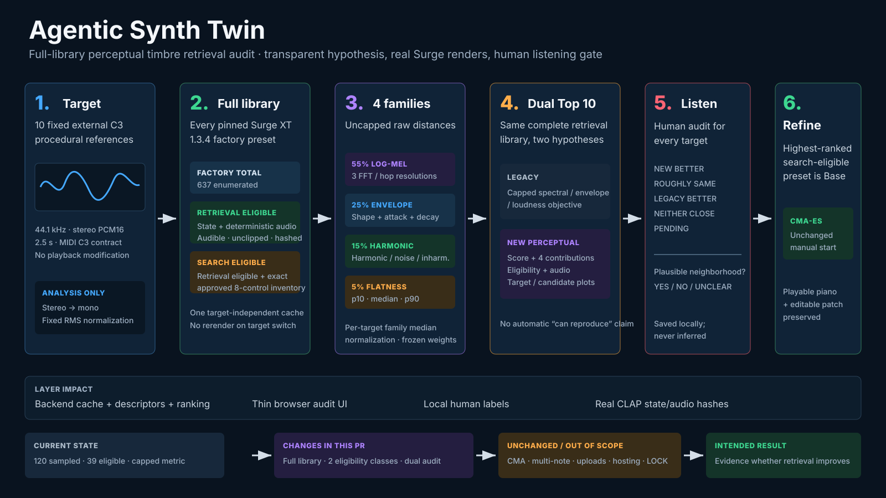

# Full-library perceptual timbre retrieval audit

## Scientific boundary

This follow-up asks whether a transparent four-family descriptor retrieves a more plausible acoustic neighborhood than the capped legacy objective, and whether the pinned Surge XT 1.3.4 factory library contains a reasonably close preset before optimization. It does not claim instrument recognition, reconstruction, perceptual equivalence, or correctness across notes and velocities. CMA-ES remains a separate, manually started local-refinement experiment and cannot repair the retrieval conclusion retroactively.

## Complete library and eligibility

The external-target controller enumerates all 637 presets under Surge XT 1.3.4's authoritative `patches_factory/` tree in deterministic path order. The broader content bundle contains additional non-factory and third-party patches; those are deliberately not mislabeled as factory presets. One cache identity binds the plugin ID and binary hash, every factory-content file hash, the fixed audition, deterministic overrides, and descriptor version. Switching among the ten canonical targets reuses the cache and never rerenders the library.

Retrieval eligibility requires native-state extraction, two byte-identical real-CLAP renders, an audible unclipped result, and hashed state/WAV/descriptor evidence. Search eligibility is stricter: it additionally requires the exact current eight-control inventory. Retrieval-only presets remain in both rankings; the CMA Base is the highest new-ranking result that is also search eligible, with its true retrieval rank preserved.

## Frozen descriptor hypothesis

Both target and candidate are aligned over the complete 2.5-second file, folded to mono, and scaled to RMS `0.1` for analysis only. Playback WAVs remain untouched and absolute RMS is diagnostic only.

| Family | Weight | Raw uncapped distance |
| --- | ---: | --- |
| Multi-resolution log-mel | 55% | Mean absolute difference over 96 bands from 30–16,000 Hz at FFT/hop `512/128`, `2048/512`, and `8192/2048`, averaged across resolutions. |
| Envelope / attack / decay | 25% | `0.60 ×` normalized smoothed-RMS curve MAE + `0.20 ×` 10→90% attack-time difference in seconds + `0.20 ×` post-peak 90→40% decay-time difference in seconds. Unreached thresholds are right-censored at the available duration. |
| Harmonic / noise / inharmonicity | 15% | Fixed `f0 = 130.8127826502993 Hz`; `0.70 ×` harmonic-profile MAE + `0.20 ×` noise-ratio difference + `0.10 ×` inharmonicity difference, with ±30-cent harmonic and ±50-cent peak-search tolerances. |
| Spectral flatness | 5% | Mean absolute difference across p10/median/p90 flatness using FFT/hop `2048/512`. |

For each target, every family is divided by its median raw distance across the complete retrieval-eligible library. The normalized distances and weighted contributions remain uncapped. Weights are frozen before real results are inspected.

## Cockpit audit workflow

Choose one canonical target, then compare the legacy Top 10 with the perceptual Top 10. Every new row exposes rank, name/category metadata, total retrieval score, four weighted contributions, retrieval/search eligibility, and untouched audio. Selecting either ranking row shows Target versus Selected waveform and log-mel views plus a component table. The owner records exactly one comparison status—`NEW BETTER`, `ROUGHLY SAME`, `LEGACY BETTER`, `NEITHER CLOSE`, or `PENDING`—and one plausible-neighborhood status—`YES`, `NO`, or `UNCLEAR`; these values are saved locally and never inferred.

The same playable Base/Best patch, piano, computer mapping, velocity/octave controls, optional Web MIDI, live CMA telemetry, and target-specific immutable run evidence remain. Search does not start when the target changes.

## Sanity and acceptance

`tests/test_perceptual_retrieval.py` checks exact self-distance, analysis-gain behavior, synthetic harmonic/envelope directionality, descriptor persistence tolerance, median normalization, and the absence of score caps. `scripts/audit_perceptual_retrieval.py` performs a category-spread self-retrieval audit plus real near-state retrieval from small discovered cutoff changes; it records all source ranks and Top 10 failures without retuning weights.

Automated evidence can establish cache coverage, deterministic rendering, metric arithmetic, ranking reproducibility, and sanity-check outcomes. Only the owner can decide whether the new neighborhood is actually better or useful by listening. A numerically improved ranking with `NEITHER CLOSE` is still a failed retrieval result.

## Real-library audit result

The pinned Surge XT 1.3.4 factory inventory contains 637 presets. The reproducible cache accepted 467 for retrieval (73.3%), accepted 257 for both retrieval and the exact eight-control CMA search boundary (40.3%), and rejected 170 because they did not complete the deterministic render/descriptor contract. The shared cache identity is `579fa526c21e0bee682bc7e3f8011be5b6fb78fba09f52ac19db8ac74ee95ead`. During manual browser QA, a small number of later Base initializations failed the independent two-render equality gate and passed on a subsequent attempt; therefore byte identity is evidence for each successful verification event, not proof of longitudinal plugin stability across every future host invocation.

| External target | Perceptual #1 | Legacy #1 | CMA Base rank in perceptual list |
| --- | --- | --- | ---: |
| Analog Sub Bass | `Leads/Classical.fxp` | `Leads/Oldest Trick In The Book MW.fxp` | 1 |
| FM Bell | `Basses/Dist Bass 2.fxp` | `Plucks/Ambient E-Guitar.fxp` | 1 |
| Plucked Electric Guitar | `Plucks/Pinkerton Tinfurter.fxp` | `MPE/Bloom.fxp` | 5 |
| Rhodes-style Electric Piano | `Plucks/Freedom Fries.fxp` | `Leads/Sine Lead.fxp` | 9 |
| Muted Synth Pluck | `Plucks/80s Gliss.fxp` | `Basses/Lord Sawtooth.fxp` | 4 |
| Analog Brass Stab | `Polysynths/Anthemish 2.fxp` | `Leads/Classical.fxp` | 1 |
| Warm Poly Pad | `Pads/Stretch.fxp` | `Leads/Pet.fxp` | 1 |
| Sync / Hard Lead | `Polysynths/Japanese Space-ulation Wheel.fxp` | `Basses/Behemoth.fxp` | 4 |
| Marimba / Mallet | `Keys/EP 2.fxp` | `Plucks/Ambient E-Guitar.fxp` | 13 |
| Dub Chord / Organ Stab | `Plucks/Trancy.fxp` | `MPE/Bloom.fxp` | 1 |

The sanity audit retrieved all 12 category-spread source presets at rank 1 with near-zero score and kept all four two-percent cutoff perturbations' source presets in the Top 10. This supports implementation coherence only. Every target's listening comparison remains `PENDING`, every plausible-neighborhood judgment remains `UNCLEAR`, and no reproduction claim is made. The committed machine-readable ledger is [`docs/evidence/milestone-9/perceptual-retrieval-audit.json`](evidence/milestone-9/perceptual-retrieval-audit.json).

## Explicitly unchanged or out of scope

No arbitrary upload, pitch detection, multi-note or velocity sweep, loudness normalization of playback, learned embedding, semantic model, additional optimizer, native realtime host, hardware integration, public hosting, or LOCK is added. `clap-saw-demo`, the hidden reachable-target regression, and the existing CMA-ES implementation remain supported.
