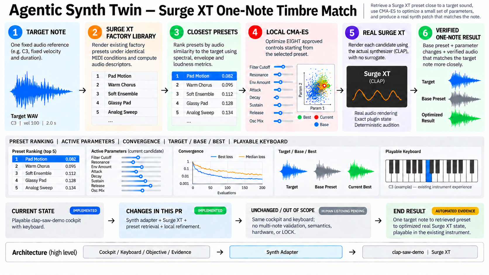

# Milestone 9: Surge XT one-note timbre match



## Verified status and starting point

- Repository: `jeremybboy/agentic-synth-twin`
- Starting point: `main` at merge commit `44b531e`, after the playable-cockpit pull request was merged
- Branch: `codex/milestone-9-surge-one-note`
- Pull request: [#13](https://github.com/jeremybboy/agentic-synth-twin/pull/13)
- Status: implemented and locally verified; owner review and perceptual acceptance pending
- Real synth: Surge XT CLAP `1.3.4`, plugin ID `org.surge-synth-team.surge-xt`

## Goal and user-visible workflow

Keep the same playable Agentic Synth Twin cockpit while expanding the sound engine underneath it. The fixed Target is compared against a bounded real Surge XT factory index; the Top 5 are auditionable; the closest valid preset becomes Base; local CMA-ES refines eight real continuous parameters; Target, Base, and Best remain playable through the same piano, Ableton-style computer mapping, velocity/octave controls, optional Web MIDI, editable working copy, and rendered-note cache.

## Transparency/change ledger

| Area | Verified Milestone 9 boundary |
| --- | --- |
| Current state | One `clap-saw-demo` starting patch could be searched and played through the local cockpit. |
| User-visible change | The same cockpit now supports Surge XT Target/Base/Best audition, a Top 5 preset shortlist, eight live/editable real parameters, and preserved keyboard playability. |
| Code/data layers touched | Process-isolated synth adapter, Surge native preset extraction, CLAP probe/renderer precision contract, bounded preset index, local refinement controller, existing cockpit, regression tests, local reproduction scripts, compact evidence, and documentation. |
| Explicitly untouched | Existing `clap-saw-demo` workflow, objective formula, keyboard mappings, immutable search history, multi-note validation, phrase/chord/velocity objectives, semantic prompts, hardware synths, public hosting, native realtime hosting, and LOCK. |
| Persistence and undo impact | Generated Surge artifacts, states, WAVs, and full run evidence remain under ignored `work/`. Cockpit edits remain a separate working copy and never rewrite preset retrieval or search evidence. No saved-patch LOCK/undo contract is added. |
| Audio and realtime impact | All scientific and playable audio comes from the real Surge CLAP through exact process-isolated renders. First-strike latency and the six-second note cache remain; this is not a persistent realtime host. |
| C2PA and provenance impact | No C2PA semantics changed. Audio provenance is strengthened locally through plugin/version, release checksums, native-state hashes, parameter IDs/values, render configuration, WAV hashes, and final rerender comparison. |
| Automated evidence | 89 unit/integration tests pass; strict C++ compilation, Python byte-compilation, shell syntax, diff checks, 120-preset attempt, 65-entry deterministic index, 120 CMA evaluations, 120 fair random evaluations, and an exact final rerender pass. |
| Human acceptance still required | Owner must hear Target/Base/Best and judge whether Best is audibly closer; browser piano/computer-key play and optional macOS USB MIDI remain manual/device-dependent checks. |

## Implemented phases

1. Formalize `ClapSynthAdapter` and keep the legacy direct-search path intact.
2. Download checksum-pinned official Surge XT 1.3.4 plugin/content artifacts locally; inspect 775 real parameters.
3. Extract native state from factory FXP files and force six discovered oscillator Retrigger controls for repeatable audition.
4. Attempt a deterministic category-balanced set of 120 factory presets; accept 65 and record 55 exclusions (44 nondeterministic, 6 silent, 5 clipping).
5. Rank the accepted set using the unchanged spectral/envelope/loudness objective; select `Basses/Attacky.fxp` at loss `0.281768571357`.
6. Run CMA-ES with seed `20260930`, eight continuous controls, normalized bounds 0..1, sigma 0.18, population 8, 15 generations, and 120 evaluations.
7. Penalize and retain two clipped CMA proposals as invalid worst-loss evidence; never admit them as Best.
8. Reach final loss `0.028968679924`, an `89.718981%` reduction from Base, above the predeclared 25% numeric gate.
9. Run equal-budget bounded random search with seed `20260931`; its best loss is `0.184376533661`.
10. Independently rerender Best twice and match the search-best SHA-256 `7e1f0848eadf30fa622da32f1a3be1883e6a4ab11ba2495b54501ab4a63f49b1` byte-for-byte.

## Top 5 retrieval result

| Rank | Factory preset | Total loss |
| ---: | --- | ---: |
| 1 | `Basses/Attacky.fxp` | 0.281768571357 |
| 2 | `Percussion/Kick Tech 2.fxp` | 0.436192161480 |
| 3 | `Basses/Bass 3.fxp` | 0.467816707818 |
| 4 | `Percussion/Kick Tech 1.fxp` | 0.487153277341 |
| 5 | `Basses/Bass 4.fxp` | 0.505047669475 |

## Final changed parameters

| Real CLAP parameter | Base | Best |
| --- | ---: | ---: |
| A Osc 1 Shape | 0.500000 | 0.519666 |
| A Osc 1 Width 1 | 0.140178 | 0.287742 |
| A Osc 1 Unison Detune | 0.200000 | 0.883667 |
| A Filter 1 Cutoff | 0.351346 | 0.581074 |
| A Filter 1 Resonance | 0.000000 | 0.204404 |
| A Amp EG Attack | 0.000000 | 0.190559 |
| A Amp EG Decay | 0.615385 | 0.188693 |
| A Amp EG Release | 0.230769 | 0.012697 |

## Non-goals and stop conditions

This pull request does not prove whole-instrument reconstruction, behavior away from C3, velocity generalization, semantic text-to-sound, universal CMA superiority, or human perceptual equivalence. It does not add a generic preset browser, another synth, hardware integration, a frontend rewrite, public deployment, or LOCK. Work stops at one reviewable pull request and must not proceed to multi-note matching before owner review.

## Automated checks and manual acceptance

Run:

```bash
PYTHONPATH=src python3 -m unittest discover -s tests -v
python3 -m compileall -q src tests
git diff --check main...HEAD
scripts/reproduce_surge_match.sh
scripts/run_surge_match.sh
```

Then open `http://127.0.0.1:8879`, hear Target and all Top 5 presets, compare Target/Base/Best, load Base and Best into the working patch, play the on-screen and computer keyboards, move every approved parameter, and continue playing. If available, connect a macOS USB MIDI controller and verify note/velocity input. Record human judgment separately as `YES — Best is audibly closer`, `NO`, or `NO CLEAR DIFFERENCE`.

Do not merge automatically. The owner visually inspects the diff and cockpit, performs the listening/device checks, and manually merges only if accepted.
