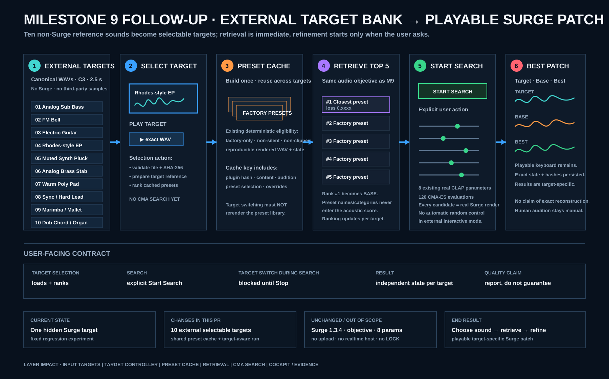

# Milestone 9: selectable external targets and Surge XT one-note match



## Verified status and starting point

- Repository: `jeremybboy/agentic-synth-twin`
- Base: `main` at `44b531e23bf04f36c04966418110a9ff1d30f488`
- Branch: `codex/milestone-9-surge-one-note`
- Pull request: [#13](https://github.com/jeremybboy/agentic-synth-twin/pull/13)
- Real synth: Surge XT CLAP `1.3.4`, plugin ID `org.surge-synth-team.surge-xt`
- Status: implementation and automated real-plugin checks complete; owner browser/audio acceptance pending

## Goal and user-visible workflow

Keep the existing playable cockpit and expand its single hidden regression target into ten named external procedural C3 references. A target click reuses one target-independent real-Surge preset cache, ranks an auditionable Top 5, selects Base, and creates a clean target-specific run; it never starts search automatically. The user then presses **Start Search**, watches the existing CMA-ES telemetry, auditions Target/Base/Best, loads Base or Best into the editable working patch, and plays it with the same piano, computer mapping, or optional Web MIDI controller.

## Transparency/change ledger

| Area | Verified boundary |
| --- | --- |
| Current state | PR #13 already provided a hidden reachable Surge target, bounded factory retrieval, eight-control local refinement, and the preserved playable cockpit. |
| User-visible change | Ten discrete named external targets, explicit non-Surge provenance, target-specific Top 5/Base, manual search start, and clean target switching. |
| Code/data layers touched | Canonical target bank/validator, shared eligible-preset cache, target controller, cockpit selector/API, local scripts, tests, compact evidence, documentation, and synchronized SVG. |
| Explicitly untouched | `clap-saw-demo`; objective formula; keyboard mappings; editable patch; hidden-target regression; multi-note/velocity/phrase matching; upload/pitch detection; semantic models; hardware synths; public hosting; native realtime hosting; LOCK. |
| Persistence/undo impact | Canonical target WAVs are immutable committed fixtures. Shared cache and per-target run states/audio/history stay in ignored `work/`; switching never deletes or overwrites another run. Working-patch edits remain non-authoritative and do not mutate search evidence. |
| Audio/realtime impact | Every preset, candidate, Base, Best, and playable note remains a process-isolated real CLAP render. External targets are exact procedural WAVs. First-strike latency and the six-second note cache remain; this is not a realtime host. |
| C2PA/provenance impact | No C2PA behavior changes. Provenance is explicit: targets are original procedural, non-Surge, sample-free references; synth results bind plugin/state/parameter/render/WAV hashes. |
| Automated evidence | 97 tests pass; target manifest/hash/format validation passes; one real cache ranked all ten targets; three 120-evaluation real-Surge searches completed; every final Best matched an independent rerender byte-for-byte. |
| Human acceptance still required | Owner must hear each selected Target/Top 5/Base/Best, judge whether Best is useful, verify selector/history reset, play Base/Best through the piano and computer keys, and optionally test USB MIDI on macOS. |

## Implemented sequence

1. Validate the exact ten-file external target manifest, stable order, paths, format, hashes, and provenance flags.
2. Build one target-independent cache from 120 category-balanced Surge factory attempts.
3. Reject presets that fail deterministic/audible/unclipped rendering or do not expose the exact authorized eight-control inventory; 39 were eligible in this environment.
4. For each selected target, reuse the cache, apply the unchanged objective, render an auditionable Top 5, select Base, and initialize an `IDLE` run.
5. Reject target switching while search is active or paused and preserve separate target run directories.
6. Keep the existing manual Start/Pause/Resume/Stop controls, plots, histories, editable Base/Best patch, piano, Ableton-style keys, velocity/octave controls, Web MIDI, and note cache.
7. Preserve the original hidden reachable-target reproduction, numeric gate, and equal-budget random control as a separate regression path.

## Real-plugin result

All ten targets produced a Top 5 and Base using cache identity `ce6f61dbab39a3d12e265a8066c90a36097264eba7cc243b428e14dfd512be87`; the full preset cache was not rerendered on target changes.

| Target | Selected Base | Base loss | Best loss | Improvement | Final verification |
| --- | --- | ---: | ---: | ---: | --- |
| Analog Sub Bass | `Leads/Bad Childhood.fxp` | 0.632506 | 0.551330 | 12.83% | byte-identical |
| Plucked Electric Guitar | `MPE/The Elephant Told You.fxp` | 0.753503 | 0.746253 | 0.96% | byte-identical |
| Rhodes-style Electric Piano | `Basses/Bass 2.fxp` | 0.519015 | 0.346361 | 33.27% | byte-identical |

This proves bounded retrieval, target isolation, search execution, and real-synth rerender identity. It does not prove the guitar result sounds like a guitar; its 0.96% proxy improvement is weak and must be judged honestly by ear.

## Verification

```bash
PYTHONPATH=src .venv/bin/python3 -m unittest discover -s tests -v
.venv/bin/python3 -m compileall -q src tests
git diff --check main...HEAD
scripts/validate_external_targets.sh
sh -n scripts/*.sh
scripts/run_surge_match.sh
```

Manual browser acceptance: open `http://127.0.0.1:8879`; select several targets; hear exact Target and every Top 5; confirm selection stops at `IDLE`; start one search; confirm selection locks until Stop/completion; compare Target/Base/Best; load and edit Base/Best; play all visible white/black keys and the Ableton mapping; optionally connect USB MIDI. Human judgment remains `PENDING_OWNER_AUDITION`.

Do not merge automatically. The owner reviews this same PR, performs the listening/browser checks, and manually merges only if accepted.
