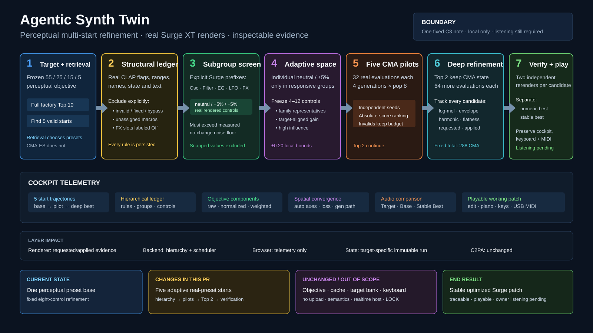

# Perceptual multi-start real-Surge refinement

Repository: `jeremybboy/agentic-synth-twin`

Starting point: `origin/main` at `d7a7f5ff86da09aa6247316fda04cbf4ee69992d` (merged PR #13)

Implementation branch: `codex/perceptual-multistart-refinement`

Status: implemented and validated locally; 118 automated tests and three complete real-render runs pass; owner listening remains pending.



## Goal and user-visible workflow

Use the unchanged full-factory perceptual retrieval to supply several plausible Surge XT starting presets, transparently discover a small responsive continuous search space for each real patch, refine those starts with a fixed two-stage CMA-ES schedule, independently rerender the numerical candidates, and adopt the first stable result into the existing playable cockpit. The owner can inspect every exclusion and probe, compare Target, Base, Numeric Best, and Stable Best, edit the resulting real controls, and play the patch through the existing on-screen, computer, or optional Web MIDI keyboards.

## Transparency / change ledger

- **Current state:** Milestone 9 retrieves a factory preset with a frozen perceptual score and manually refines one fixed eight-control space.
- **User-visible change:** the cockpit shows five independently screened preset trajectories, responsive modules and parameters, pilot and deeper CMA stages, the four frozen objective contributions, and separate numeric and stable best results.
- **Code and data layers touched:** CLAP probe/render evidence, Surge adapter readback, frozen perceptual scoring, hierarchical screen and CMA scheduler, target run controller, thin browser telemetry, reproduction/export scripts, tests, and evidence documentation.
- **Explicitly untouched:** the ten external targets, full-factory cache, descriptor family weights, family medians, C3/velocity/duration audition, hidden reachable-target regression, `clap-saw-demo`, keyboards, Web MIDI, and all Milestone 9 limitations.
- **Persistence and undo impact:** no project editor or undo model changes. Target-specific run evidence is immutable; the working patch adopts only an independently stable result.
- **Audio and realtime impact:** all screening, search, and verification renders are offline real-Surge CLAP renders. This does not add a native realtime host or claim glitch-free performance.
- **C2PA and provenance impact:** no C2PA or provenance semantic change.
- **Automated evidence required:** unit and integration tests, compile checks, script and JavaScript syntax checks, SVG parsing/render inspection, three completed real-render runs with one unchanged configuration, and a path-sanitized committed evidence export.
- **Human acceptance still required:** Target/Base/Best timbre listening, cockpit browser behavior, keyboard interaction, and optional USB MIDI behavior remain owner checks; automated scores do not establish perceptual equivalence.

## Implementation phases

### Phase A — exact renderer and scoring evidence

- Preserve strict parameter retention by default and add an explicit record mode that retains requested values, applied values, and any Surge coercion.
- Persist the real CLAP display text for the current patch without inferring enum meanings.
- Reuse the frozen four-family objective with target-level medians fixed before screening or optimization.

### Phase B — transparent hierarchical parameter screen

- Produce a complete structural inclusion/exclusion ledger from real CLAP metadata and current state.
- Exclude only explicit invalid, fixed, non-audio, bypass, unassigned-macro, routing/capacity, and currently `Off` FX-slot controls.
- Measure four no-change renders, then matched neutral/−5%/+5% subgroup probes.
- Probe individual controls only inside responsive subgroups and record all four family effects, invalid reasons, hashes, and requested/applied values.
- Freeze 4–12 controls by one target-independent selection rule; skip starts that cannot expose four valid continuous controls.

### Phase C — fixed multi-start optimization and verification

- Scan perceptual Top 10 until five valid starts are found or the list is exhausted.
- Run a 32-evaluation CMA pilot for each valid start, rank by absolute frozen score, and deepen the best two for 64 additional evaluations each without resetting optimizer state.
- Count invalid renders against the fixed budget and retain their evidence.
- Independently rerender distinct numeric candidates twice; require matching audio hashes and applied-value readbacks, never retry a failed candidate, and keep numeric and stable best separate.
- Adopt only the stable best into the editable/playable working patch.

### Phase D — cockpit, reproduction, and evidence

- Extend the existing thin cockpit; do not replace it or remove any keyboard path.
- Run Rhodes first, then electric guitar and sub-bass with the identical descriptor, screen, and optimizer configuration.
- Export one path-sanitized evidence snapshot containing all exclusions, module probes, parameter probes, histories, objective components, and verification attempts.

## Non-goals and stop conditions

Do not add arbitrary upload, pitch detection, multi-note or velocity-sweep validation, semantic/instrument recognition, learned embeddings, new optimizers, public hosting, cloud services, loudness normalization, a native realtime host, hardware integration, or LOCK. Do not tune weights, selection rules, or CMA settings after seeing Rhodes. If real plugin metadata and state cannot support a principled initial exclusion ledger, stop and report the insufficiency instead of inventing parameter semantics; preserve cross-target failures rather than weakening the checks.

## Automated checks

```bash
PYTHONPATH=src python3 -m unittest discover -s tests -v
python3 -m compileall -q src tests
sh -n scripts/reproduce_perceptual_multistart.sh
sh -n scripts/generate_synthetic_dataset.sh
git diff --check main...HEAD
```

Milestone-specific evidence must additionally show completed Rhodes, electric-guitar, and sub-bass runs under one frozen configuration, the exact per-start budget, complete hierarchical ledgers, and independent verification records.

## Manual acceptance

1. Open the completed Rhodes cockpit and audition Target, Base, Numeric Best, and Stable Best.
2. Confirm that the five starts, responsive subgroup table, selected 4–12 parameters, four contribution values, convergence history, and verification state agree with the evidence.
3. Edit the adopted stable patch and play white/black notes with the mouse and computer keyboard.
4. On macOS, optionally connect a USB MIDI keyboard, grant browser MIDI permission, and verify note-on/note-off behavior.
5. Repeat the Target/Base/Best listening judgment for electric guitar and sub bass; record failures honestly.

Open the PR ready for owner review only after the automated evidence passes. Do not merge or enable auto-merge.

## Verified implementation evidence

- Rhodes, electric guitar, and sub bass each exposed five valid adaptive starts and consumed exactly 288 CMA evaluations under identical configuration and family weights.
- Rhodes numeric best: `0.167452`; first verified stable result: `0.181136` on verification attempt 4.
- Electric-guitar numeric/stable best: `0.333648` on verification attempt 1.
- Sub-bass numeric/stable best: unchanged screened Base at `0.407065`; optimization did not improve it.
- The committed evidence preserves all structural ledgers, subgroup and individual probes, CMA candidates, component contributions, invalid records, and verification attempts; all human judgments remain `PENDING_OWNER`.
