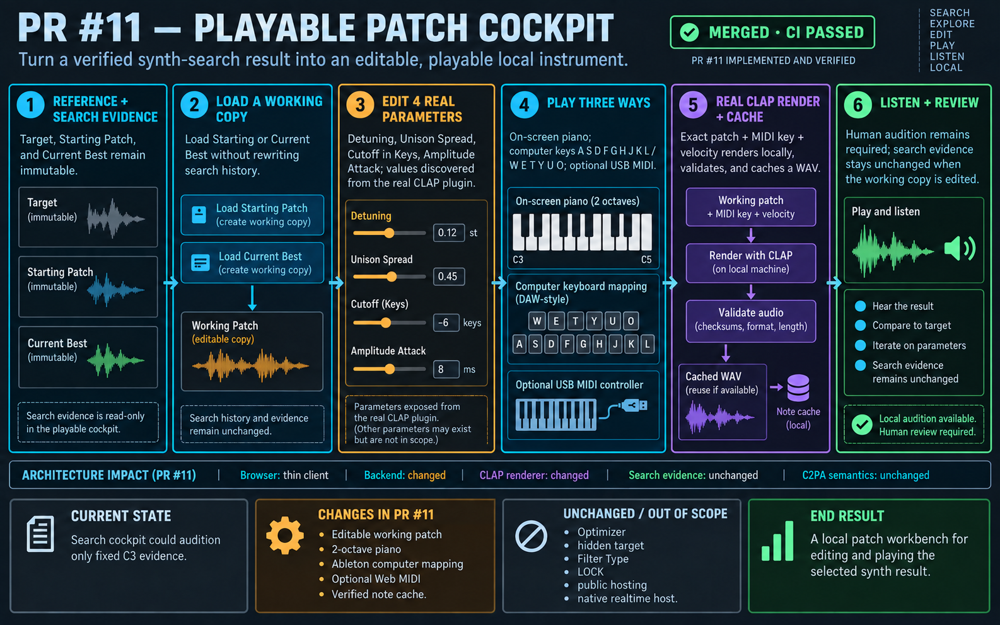

# PR #11: playable patch cockpit

## Verified status and starting point

- Repository: `jeremybboy/agentic-synth-twin`
- Pull request: [#11 — feat: add playable patch cockpit](https://github.com/jeremybboy/agentic-synth-twin/pull/11)
- Starting point: `main` at `b94a206`, after Milestone 8A
- Implementation commits: `9269c4e` and `1cc1a7d`
- Status: merged; required GitHub CI passed

## Goal

Turn the Milestone 8A search result into a practical local instrument audition: keep Target, Starting Patch, Current Best, and search history as immutable evidence; copy Starting or Current Best into an editable working patch; then play that patch through the real CLAP synth.

## Transparency/change ledger

| Area | Verified PR #11 boundary |
| --- | --- |
| Current state | The search cockpit could audition only the fixed deterministic C3 evidence renders. |
| User-visible change | Load Starting or Current Best, edit four real-plugin parameters, and play notes from an on-screen piano, Ableton-style computer keys, or optional Web MIDI. |
| Code/data layers touched | Thin browser client, Python search backend, CLAP renderer, ignored local note cache, tests, and user documentation. |
| Explicitly untouched | Optimizer behavior, hidden target, immutable search evidence, Filter Type, LOCK, public hosting, and native realtime hosting. |
| Persistence/undo impact | Edits live only in the working copy and cached renders; they do not rewrite the candidate, target, optimizer, or search history. No LOCK or saved-patch restore contract was added. |
| Audio/realtime impact | Each unseen patch/key/velocity tuple renders a validated six-second WAV through the real CLAP plugin and caches it locally. This is not a persistent realtime plugin host. |
| C2PA/provenance impact | None. PR #11 did not change C2PA or provenance semantics. |
| Automated evidence | 76 tests, Python byte-compilation, strict C++ compilation, diff checks, and required GitHub CI passed for the merged PR. |
| Human acceptance still required | Listening quality and optional macOS USB-MIDI/browser-permission behavior remain perceptual and hardware-dependent checks. |

## Implemented flow

1. Preserve Target, Starting Patch, Current Best, and search history as read-only evidence.
2. Copy Starting or Current Best into a separate editable working vector.
3. Expose the four search coordinates discovered from the real plugin: Oscillator Detuning, Unison Spread, Cutoff in Keys, and Amplitude Attack.
4. Accept note input from the two-octave piano, the documented Ableton key map, or optional Web MIDI.
5. Render and validate exact patch, MIDI key, and velocity tuples through the real CLAP plugin; reuse the content-addressed local cache.
6. Leave listening and hardware behavior to explicit human acceptance.

## Non-goals and stop conditions

PR #11 did not add a native realtime host, public deployment, loudness normalization, a new optimizer, Filter Type search, a semantic model, or LOCK. The implementation must not claim plugin-authentic early note release, sustain pedal support, aftertouch, pitch bend, or guaranteed low-latency performance.

## Manual review

Run `scripts/run_direct_search.sh`, open the reported loopback URL, load Starting or Current Best, edit a parameter, and play the on-screen and computer keyboards. If hardware is available, connect a macOS USB MIDI controller in a compatible browser and confirm permission, note range, and velocity behavior. Human acceptance is evidence; it is not replaced by CI.
